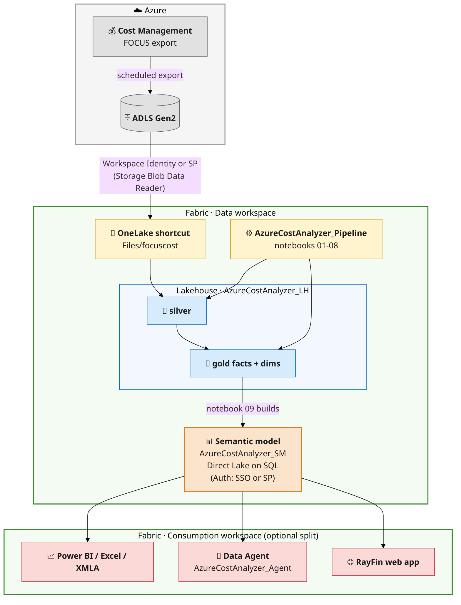
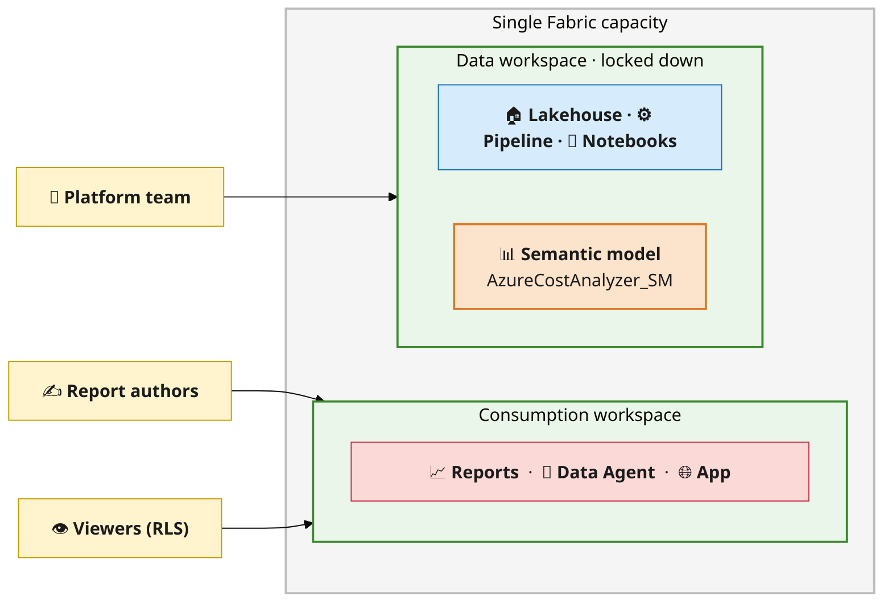

# Architecture

Azure Cost Analyzer (ACA) is a **medallion** FinOps solution on Microsoft Fabric. It ingests Azure
Cost Management **FOCUS** exports, refines them through silver and gold layers, and serves them via a
**Direct Lake** semantic model — optionally with a Data Agent and a web app on top.

---

## Components

| Component | Fabric item | Role |
|---|---|---|
| **Lakehouse** | `AzureCostAnalyzer_LH` | Stores bronze/silver/gold Delta tables and the raw FOCUS export (via shortcut) |
| **Pipeline** | `AzureCostAnalyzer_Pipeline` | Orchestrates notebooks `01`–`08` on a schedule |
| **Notebooks** | `00`–`09` | Deploy, ingest, transform, and build the model (see [../notebooks/README.md](../notebooks/README.md)) |
| **Semantic model** | `AzureCostAnalyzer_SM` | Direct-Lake-on-SQL model: 13 tables, relationships, ~30 measures |
| **Data Agent** *(optional)* | `AzureCostAnalyzer_Agent` | Natural-language Q&A grounded on the model |
| **Web app** *(optional)* | RayFin app *(separate repo)* | Cost / chargeback / governance / anomaly views |

---

## Architecture

Components, data flow, and authentication in one view:

> Renders inline on GitHub. In VS Code, install the *Markdown Preview Mermaid Support* extension to
> preview it.

### Medallion layers

1. **Bronze / raw** — FOCUS parquet exports surfaced in the lakehouse via a **OneLake shortcut**
   (`Files/focuscost`). No copy.
2. **Silver** — `01` loads and normalizes FOCUS rows into `focus_partitioned` (partitioned by
   `Year`/`Month`, enriched with `Date`, `YearMonth`, `ResourceGroupName`, `ResourceType`).
3. **Gold** — `02`–`08` build purpose-built facts and dimensions (daily/monthly rollups, dynamic-tag
   chargeback, reservations, anomalies, resource detail, calendar). See
   [data-model.md](data-model.md).
4. **Serve** — `09` builds the Direct-Lake-on-SQL model consumers query.

---

## Dynamic tags

Cost-allocation tags differ per tenant, so nothing is hard-coded:

- `05_Gold_ByTag` reads the FOCUS **`Tags`** JSON, **normalizes** keys (lower + trim so casing
  variants collapse), and ranks them by cost.
- **Every** discovered key becomes its own column in the WIDE `gold_chargeback_by_tag` fact
  (value, or `"Untagged"` when absent).
- `dim_tag_key` lists every discovered tag key with its **PascalCase column name** (in
  `gold_chargeback_by_tag`) and a **rank by cost**.
- One row per resource-month means grouping or filtering by tags never double-counts cost.

---

## Identity & security

Report/app consumers can reach the model without any lakehouse or storage permissions:

- The model is **Direct Lake on SQL**, reading through the Lakehouse **SQL analytics endpoint**.
- Choose how consumers authenticate to that endpoint:
  - **Single sign-on (SSO)** — the model queries under each caller's own Entra identity. Simplest to
    set up; each consumer needs read access to the underlying data.
  - **Fixed service principal** — bind the data source to an SP connection (SQL Server type, **SSO
    off**) so every consumer with *Build* on the model sees data through that one identity, with no
    lakehouse/storage grants of their own.
- Consumers need **Build + Read** on the model (and Viewer/Contributor on the consumption workspace).

Both approaches are covered step-by-step in [deployment-guide.md](deployment-guide.md).

### Workspace topology

For broad sharing, split into two workspaces on the **same Fabric capacity** (cross-capacity Direct
Lake is not supported): a locked-down **Data workspace** and a **Consumption workspace** with
RLS-protected viewers.

See [deployment-guide.md](deployment-guide.md) for the exact connection setup.

---

## Refresh & scheduling

- The **pipeline** runs `01`–`08` on a schedule (e.g. daily). Gold notebooks prune to the last 12
  months for cheap incremental refresh.
- `09` **reframes** the Direct Lake model (`refresh_semantic_model`) after the gold tables are
  rewritten; run it after a schema change or on its own light schedule to pick up new tag columns.
- Direct Lake means **no VertiPaq import** — queries read the latest committed Delta data.

---

## Optional add-ons

- **Data Agent (`AzureCostAnalyzer_Agent`)** — point a Fabric Data Agent at `AzureCostAnalyzer_SM` for natural-language
  cost questions.
- **RayFin web app** *(separate repo)* — a lightweight app that queries the model (via DAX over the XMLA/SQL endpoint)
  to render cost, chargeback, governance, and anomaly views.
