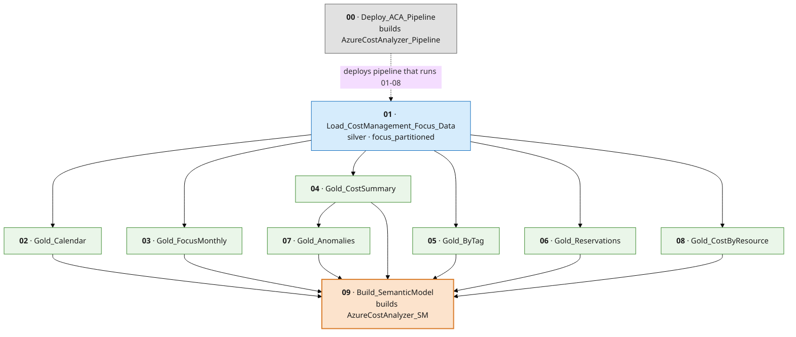

# Notebooks

The Azure Cost Analyzer pipeline is 10 idempotent Fabric notebooks. `00` deploys the orchestration
pipeline; `01`–`08` are the medallion processing steps the pipeline runs; `09` builds the semantic
model after the gold tables exist.

All notebooks are **credential-free**: the lakehouse binding is a parameterized `%%configure`
placeholder. Bind the real Lakehouse when you import them (or let the pipeline pass the IDs at
runtime).

---

## Run order (DAG)

- `01` fans out to the six gold builders; each depends only on `01`.
- `07_Gold_Anomalies` additionally depends on `04_Gold_CostSummary` (reads `gold_cost_summary_daily`).
- `09` is **not** part of the pipeline — run it manually (or on its own schedule) after the gold
  tables are populated.

---

## Notebooks

| # | Notebook | Reads | Writes | Notes |
|---|---|---|---|---|
| 00 | **Deploy_ACA_Pipeline** | — | `AzureCostAnalyzer_Pipeline` | Discovers `01`–`08` by name, builds the Data Factory DAG + parameters. Idempotent. |
| 01 | **Load_CostManagement_Focus_Data** | FOCUS parquet (`Files/focuscost`) | `focus_partitioned` (silver) | Loads FOCUS exports, partitions by `Year`/`Month`, enriches with `Date`, `YearMonth`, `ResourceGroupName`, `ResourceType`. |
| 02 | **Gold_Calendar** | `focus_partitioned` | `dim_date`, `dim_month` | Date spine derived from the data range (± buffer months). |
| 03 | **Gold_FocusMonthly** | `focus_partitioned` | `gold_cost_focus_monthly` | Enriched monthly fact with FOCUS + `x_*` extensions and a hybrid savings baseline. |
| 04 | **Gold_CostSummary** | `focus_partitioned` | `gold_cost_summary_daily`, `gold_cost_summary_monthly` | Usage-only daily & monthly rollups. |
| 05 | **Gold_ByTag** | `focus_partitioned` | `gold_chargeback_by_tag` (WIDE), `dim_tag_key` | **Dynamic tags**: one column per discovered tag key + tag universe. |
| 06 | **Gold_Reservations** | `focus_partitioned` | `gold_reservations_coverage`, `gold_reservations_waste`, `gold_reservations_detail` | Commitment coverage, utilization, per-commitment waste. |
| 07 | **Gold_Anomalies** | `focus_partitioned` | `gold_cost_anomalies` | Rolling z-score spike detection per subscription/service. |
| 08 | **Gold_CostByResource** | `focus_partitioned` | `gold_cost_by_resource` | Resource-grain fact (tag-free, keeps `TagCount` for governance). |
| 09 | **Build_SemanticModel** | all gold tables | `AzureCostAnalyzer_SM` | Direct-Lake-on-SQL model via `semantic-link-labs`: binds tables, relationships, measures, refresh + validate. |

---

## Parameters

The pipeline (`00`) passes these to `01`; the gold notebooks read the last 12 months from
`focus_partitioned` and need no parameters.

| Parameter | Default | Meaning |
|---|---|---|
| `LakehouseName` | `AzureCostAnalyzer_LH` | Target lakehouse name |
| `LakehouseId` | *(placeholder)* | Resolved at runtime / bound on import |
| `WorkspaceId` | *(placeholder)* | Resolved at runtime / bound on import |
| `FromMonth` | `-1` | Start month offset from *today − 1 day* (`0` = current month) |
| `ToMonth` | `0` | End month offset |
| `RawSourcePath` | `Files/focuscost` | Lakehouse path to the FOCUS parquet export |

`09` takes two in-notebook parameters: `lakehouse_name` (`AzureCostAnalyzer_LH`) and `model_name`
(`AzureCostAnalyzer_SM`). Run it in the **same workspace** as the lakehouse.

---

## Conventions

- **Idempotent** — re-running any notebook is safe (`overwrite` / create-or-update / drop-then-readd).
- **12-month window** — the gold notebooks prune to the last 12 months via the `Year`/`Month`
  partitions for cheap incremental refresh.
- **`ChargeCategory = 'Usage'`** — cost rollups exclude Purchase/Tax/Adjustment/Credit unless noted
  (`03_Gold_FocusMonthly` keeps all categories for flexibility).
- **Dynamic tags** — tag keys come from the FOCUS `Tags` JSON (lower-cased + trimmed so casing
  variants collapse). See [../docs/data-model.md](../docs/data-model.md).

See the [deployment guide](../docs/deployment-guide.md) for the full setup and the
[data model](../docs/data-model.md) for every table and column.
